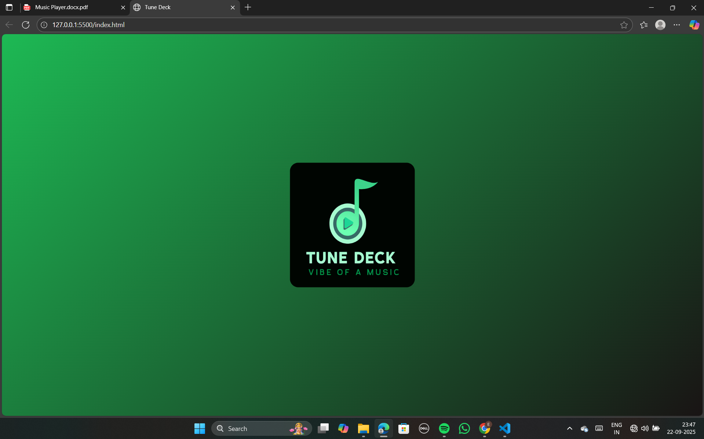
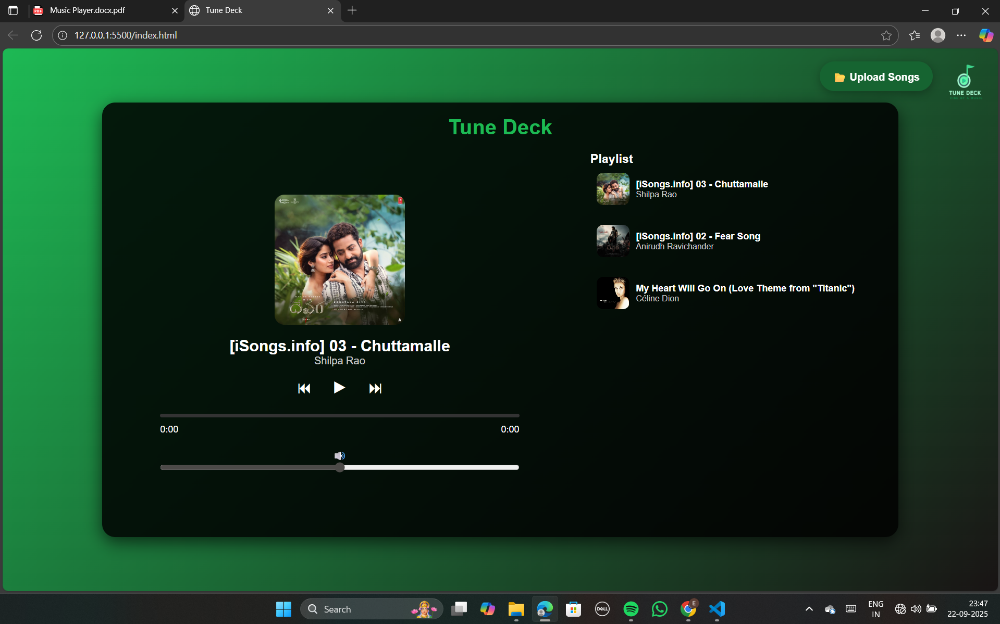

### Tune Deck Music Player

A modern web-based music player with a Spotify-like interface. 

Live Demo : https://tunedeck.netlify.app/

------

### Features include:

Loader animation with heartbeat effect.

Mini logo at top-left that keeps beating.

Playlist with song cover images, title, and artist.

Upload your own songs (supports multiple files).

----

### Audio controls: Play, Pause, Next, Previous.

Progress bar and volume control.

Responsive design for mobile devices.

----

### Demo

<table>
  <tr>
    <th> Index Page</th>
    <th> Index 2 Page</th>
    <th> Logo</th>
  </tr>
  <tr>
    <td> </td>
    <td> </td>
    <td> </td>
  </tr>
</table>


-----

### Features

Loader Animation

Central logo with a “heartbeat” animation.

Fades out after 2 seconds and shows the main player.

***Mini Logo***

Appears at the top-left after loader fades.

Continues heartbeat animation continuously.

***Playlist***

Shows uploaded songs or default songs.

Each song displays cover image, title, and artist.

Click on a song to play it.

***Audio Controls***

Play/Pause, Next, Previous buttons.

Progress bar shows current playback time.

Volume control slider.

Responsive Design

Adapts to mobile and desktop screens.

Playlist moves below content on smaller screens.

----

***Installation***

Clone the repository:
```
git clone https://github.com/22BCE8093-Eswar/Tune-Deck-Music-Player
cd tune-deck-music-player
```

Open index.html in your browser.

Upload songs using the 📂 Upload Songs button or use default songs in the songs/ folder.

***Usage***

Load Page: Central loader logo animates with heartbeat.

Player Interface: After animation, main player loads. Mini logo appears top-left.

Upload Songs: Click “📂 Upload Songs” to add your own audio files.

Play Music: Click a song in the playlist or use controls.

View Playlist: Right panel shows playlist with song covers.

***Dependencies***

jsmediatags
 — For reading MP3 metadata.

***Customization***

Change Placeholder Logo: Replace images/placeholder.png.

Change Mini Logo: Replace images/mini-logo.png.

Add Default Songs: Add MP3s to songs/ folder and update defaultSongs array in script.js.


Open index.html in your browser.

Upload songs using the 📂 Upload Songs button or use default songs in the songs/ folder.
